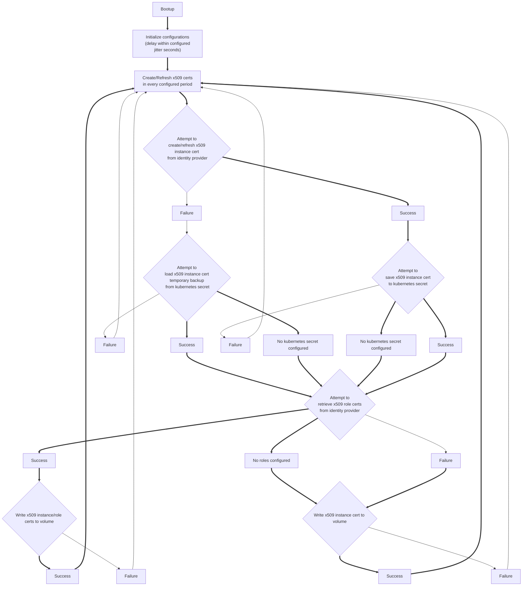

# K8s athenz SIA

## Lifecycle



## Usage
```
$GOPATH/bin/athenz-sia --help
```

### Test
```
make
```
```
POD_IP=127.0.0.1 ~/go/bin/athenz-sia --mode refresh --provider-service yby.tatyano.kaihatsu-identityd --dns-suffix yahoo.co.jp --endpoint https://apj.zts.athenz.yahoo.co.jp:4443/zts/v1 --skip-identity-provisioning --key private.key --cert service.crt --log-dir . --target-domain-roles yby.tatyano:role.users
```
